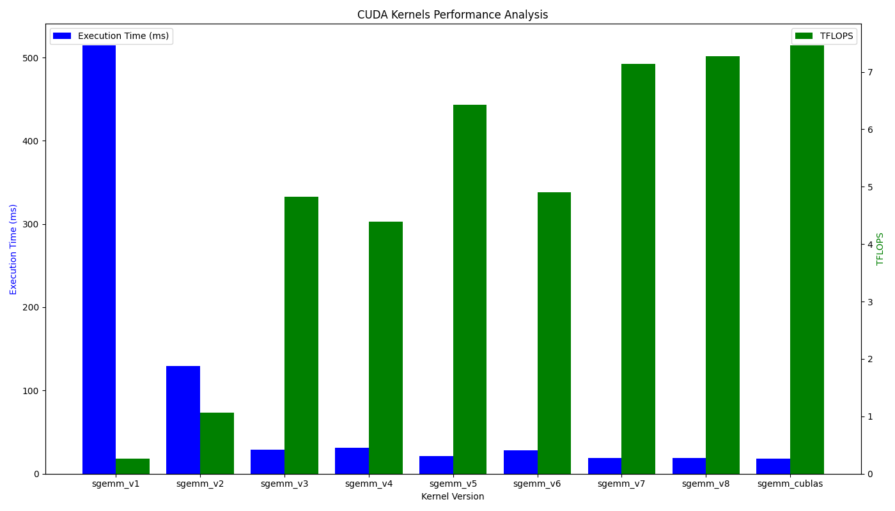

# CUDA-Optimization

A repo for writing high performance cuda kernel, such as gemm, softmax and reduce.

In future, I will merge OpenAI triton to this repo inorder to compare its performance with cuda kernel.


## SGEMM
+ M = N = K = 1024


### 1. Naive
### 2. Block Tiling
### 3. Thread Tiling
### 4. Warp Tiling
### 5. Bank Free
### 6. Pipeline
### 7. Transpose Load A && Pipline
### 8. Transpose Load A
### 9. cuBLAS
### 10. WMMA
TODO
### 11. Auto Tune
TODO
### 12. Ampere ASM
TODO

### 13. OpenAI Triton


## Softmax
TODO

## Reduction
TODO

## Build

```bash
python ./script.py
```
### Install OpenAI Triton

```bash
pip install triton
```