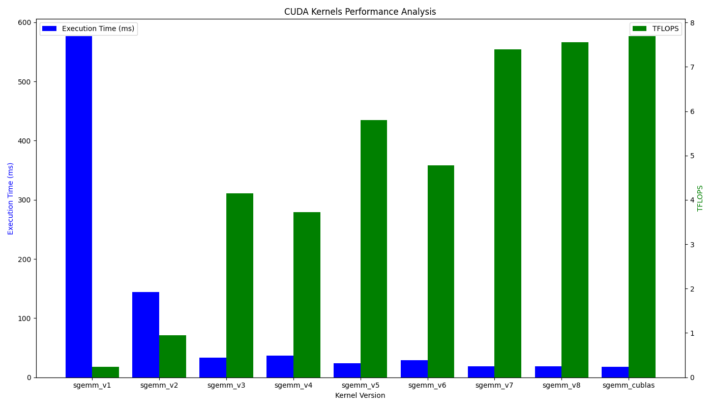

# CUDA-Optimization

## SGEMM

### 1. Naive
### 2. Block Tiling
### 3. Thread Tiling
### 4. Warp Tiling
### 5. Bank Free
### 6. Pipeline
### 7. Transpose Load A && Pipline
### 8. Transpose Load A
### 9. cuBLAS

